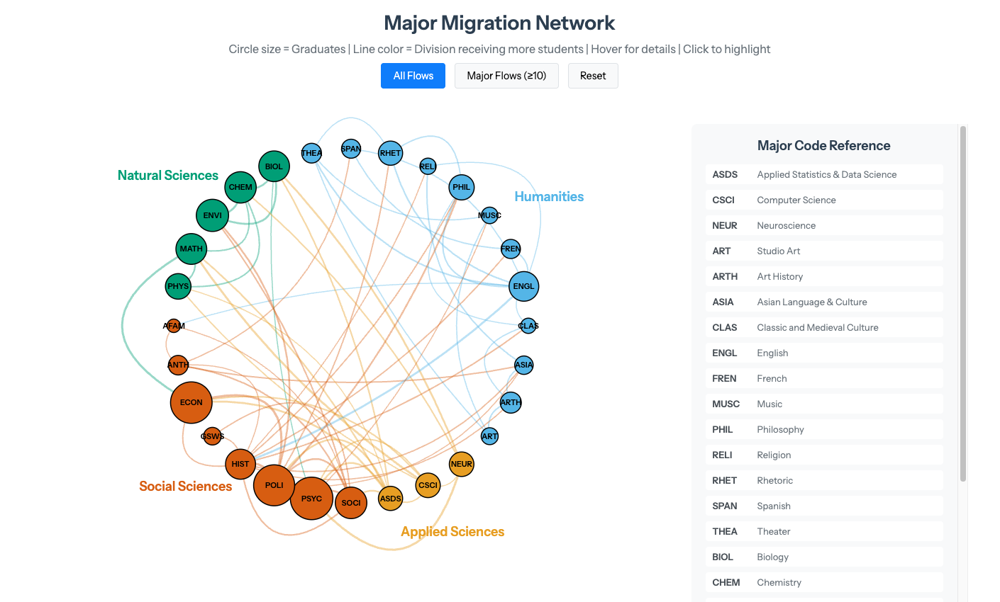

# Major Migration Dashboard

## Project Overview

This project addresses the challenge of visualizing complex student migration patterns across academic majors. It introduces an innovative **circular network visualization** that reveals which majors serve as "magnets" (attracting transfers) versus "sources" (losing students), providing actionable insights for academic departments and institutional planning.

The end product is an interactive D3.js visualization that combines intelligent collision-aware routing with semantic color coding, showcasing my ability to develop novel data visualization techniques and deploy sophisticated interactive tools.

**Live Demo:** [View Visualization](https://iecarreras-data.github.io/projects/major-migration-dashboard/major-migration-dashboard-web.html)



### Core Competencies Showcased

*   **Innovative Visualization Design:** Creating a novel hybrid visualization combining circular layouts with intelligent edge routing algorithms
*   **Interactive Web Development:** Building D3.js visualizations with hover tooltips, click interactions, and dynamic filtering
*   **Algorithm Development:** Implementing collision-aware bezier curve routing that automatically adjusts paths to avoid node clusters
*   **Data Simulation:** Generating realistic synthetic datasets that model real-world major migration patterns
*   **UI/UX Design:** Integrating reference tables, responsive layouts, and intuitive controls for exploration

---

### Tech Stack & Repository Structure

*   **Languages:** R, JavaScript (D3.js), HTML/CSS
*   **Key R Packages:** tidyverse, here, jsonlite
*   **Key JavaScript Libraries:** D3.js v7
*   **Fonts:** Google Fonts (Instrument Sans)

The repository is structured as a self-contained project to ensure full reproducibility.

```
.
├── R/
│   ├── 01_create_major_catalog.R
│   ├── 02_simulate_student_migration.R
│   └── 07_interactive_circle_network.R
├── data-raw/
│   ├── major_catalog.csv
│   └── student_migration.csv
├── data/
│   └── processed/
├── output/
│   └── major_migration_preview.png
├── .gitignore
├── LICENSE
└── README.md
```

---

### How to Reproduce This Project

Follow these steps to run the entire data pipeline and generate the final visualization.

#### 1. Setup & Prerequisites

1.  **Clone the Repository:** Clone this repository to your local machine using git clone.

2.  **Open RStudio:** Set your working directory to the project folder or open as an RStudio Project.

3.  **Install Packages:** Open the R console and install all necessary packages using pacman.

#### 2. Run the Data Generation Pipeline

The scripts in the R folder must be run in numerical order. Each script's output serves as the next script's input.

##### Running the Scripts

Execute each script in order:

```r
source("R/01_create_major_catalog.R")
source("R/02_simulate_student_migration.R")
source("R/07_interactive_circle_network.R")
```

##### Pipeline Details

1.  **01_create_major_catalog.R**
    *   **Purpose:** Creates the master catalog of 28 majors across 4 academic divisions (Applied Sciences, Humanities, Natural Sciences, Social Sciences)
    *   **Input:** None (defines the academic structure)
    *   **Output:** data/data-raw/major_catalog.csv

2.  **02_simulate_student_migration.R**
    *   **Purpose:** Generates realistic student migration data showing how students move between majors from matriculation to graduation
    *   **Input:** data/data-raw/major_catalog.csv
    *   **Output:** data/data-raw/student_migration.csv

3.  **07_interactive_circle_network.R**
    *   **Purpose:** Builds the interactive D3.js circular network visualization with collision-aware routing and reference table
    *   **Input:** data/data-raw/major_catalog.csv, data/data-raw/student_migration.csv
    *   **Output:** output/major_migration_network_interactive.html

After running all scripts, open `output/major_migration_network_interactive.html` in your web browser to view the final, interactive visualization.

---

### Key Technical Innovations

This project demonstrates several novel visualization and algorithm development techniques:

#### Novel Circular Network Design
- **Nested Circle Sizing:** Circle size represents *graduates* (not starters), visually highlighting magnet programs that attract transfers
- **Semantic Color Coding:** Connections colored by the *receiving* division (not source), making it intuitive to see which divisions attract students
- **Division-Based Layout:** Majors organized by academic division around the circle with labels positioned at median positions

#### Intelligent Collision-Aware Routing
- **Dynamic Path Adjustment:** Algorithm detects when curves would pass near other nodes and automatically increases curvature
- **Inward/Outward Logic:** Analyzes path midpoint position relative to the circle to determine optimal curve direction
- **Multi-Level Curvature:** Three-tier curvature system based on angular distance between nodes (0.5 for adjacent, 0.3 for medium distance, 0.1 for opposite sides)

#### Interactive Features
- **Bidirectional Flow Tooltips:** Hover over connections to see flows in both directions (e.g., "PSYC → NEUR: 14 | NEUR → PSYC: 3")
- **Click-to-Highlight:** Click any major to highlight all its connections while dimming unrelated elements
- **Dynamic Filtering:** Toggle between "All Flows" and "Major Flows (≥10 students)" to reduce visual complexity
- **Integrated Reference Table:** Side-by-side major code lookup table that scrolls independently

---

### Key Insights from the Data

The visualization reveals several important patterns in student major migration:

**Magnet Programs** (ending enrollment > 1.5× starting):
- **ASDS (Applied Statistics & Data Science):** 9 → 66 graduates (+633%, extreme magnet)
- **NEUR (Neuroscience):** 49 → 69 graduates (+41%)
- **CSCI (Computer Science):** 58 → 69 graduates (+19%)
- **HIST (History):** 103 → 119 graduates (+16%)

**Source Programs** (net losses):
- **ENVI (Environmental Science):** 172 → 143 graduates (-17%)
- **PSYC (Psychology):** 311 → 284 graduates (-9%)
- **ECON (Economics):** 292 → 268 graduates (-8%)

**Top Migration Flows:**
- PSYC → NEUR: 14 students
- ECON → MATH: 13 students
- ECON → ASDS: 12 students
- ENVI → CHEM: 11 students

---

### Customization

#### Modifying the Data

To adjust the simulation parameters, edit the probability distributions in `R/02_simulate_student_migration.R`:

- Change switching probabilities
- Adjust destination major preferences
- Modify cohort sizes or year ranges

#### Changing Visual Design

- **Colors:** Modify `division_colors` in `R/07_interactive_circle_network.R`
- **Circle Size:** Adjust the `radius` variable (default: 250 pixels)
- **Layout:** Change the `divisions_order` to reorder divisions around the circle
- **Curve Routing:** Modify curvature thresholds in the JavaScript `createCurvedPath()` function

---

### Future Enhancements

Potential extensions to this project:

- **Real Data Integration:** Replace simulated data with actual institutional records
- **Temporal Animation:** Show migration patterns evolving across multiple cohorts
- **Path Analysis:** Identify common multi-step migration sequences (e.g., PSYC → NEUR → ASDS)
- **Predictive Modeling:** Build models to forecast major capacity needs based on historical flows
- **Comparison Mode:** Side-by-side visualizations comparing different time periods or institutions

---

### Contact & Attribution

**Author:** Ismael E. Carreras  
**GitHub:** @iecarreras-data  
**Portfolio:** [iecarreras-data.github.io](https://iecarreras-data.github.io)

This project uses entirely synthetic data generated for demonstration purposes. All student migration records are simulated and do not represent real individuals or institutions.

---

### License

This project is licensed under the MIT License - see the LICENSE file for details.
